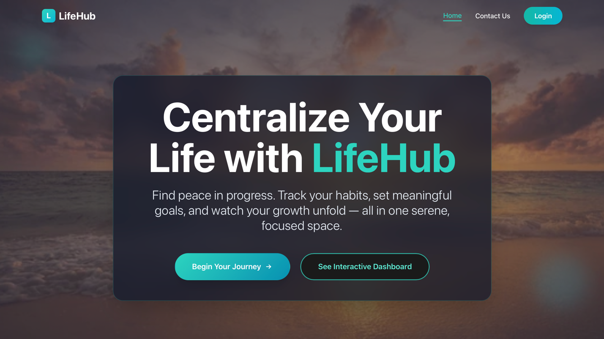
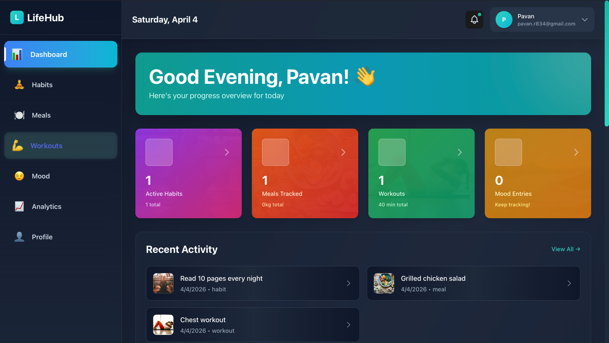
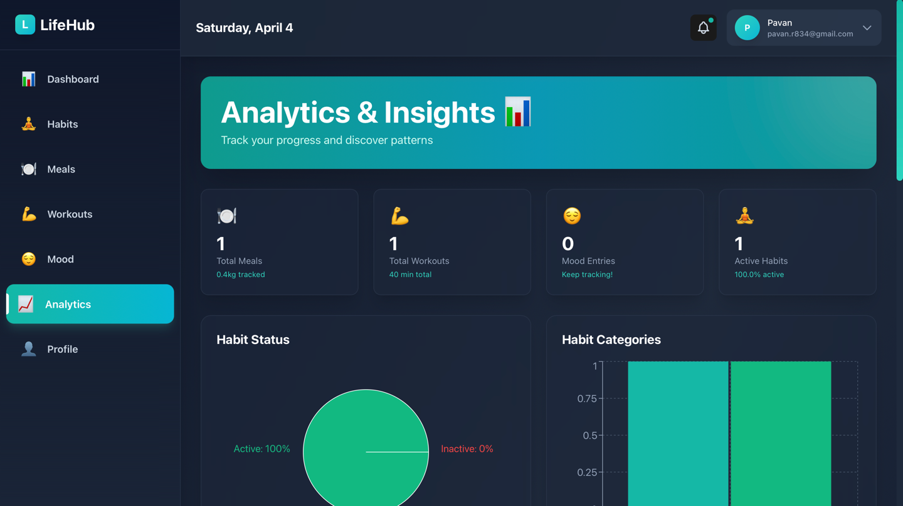

# LifeHub


A full-stack personal wellness platform for tracking habits, meals, workouts, and mood — with analytics and intelligent recommendations.

Built with Spring Boot 3.2 + React + PostgreSQL + Redis. Designed for extensibility, security, and performance.

---

## Features

- **Habit tracking** — create, update, and monitor daily habits with streak analytics
- **Meal logging** — log meals and track nutritional patterns over time
- **Workout tracking** — record exercise sessions with history
- **Mood journaling** — track emotional patterns with timestamps
- **Analytics dashboard** — personalised insights and recommendations across all modules
- **JWT authentication** — secure register/login with token refresh
- **Redis caching** — API response caching for performance
- **Docker support** — single `docker-compose up` to run everything

--- Images of Lifehub




## Tech Stack

| Layer | Technology |
|---|---|
| Backend | Java 17, Spring Boot 3.2, Spring Security, Spring Data JPA |
| Frontend | React, Vite, Tailwind CSS, Axios |
| Database | PostgreSQL 15 |
| Caching | Redis 7 |
| Auth | JWT (HS512) |
| DevOps | Docker, Docker Compose |

---

## Quick Start

### Option A — Docker (recommended)

```bash
git clone https://github.com/pavankumar3103/lifehub.git
cd lifehub

# Set up environment
cp .env.example .env
# Edit .env with your DB password and JWT secret

# Start everything
docker-compose up --build
```

- Frontend: http://localhost:5173
- Backend API: http://localhost:8080

### Option B — Local development

**Prerequisites:** Java 17+, Maven 3.6+, Node.js 18+, PostgreSQL 15+, Redis 7 (optional)

**1. Database setup**

```sql
CREATE DATABASE lifehub_db;
CREATE USER lifehub_user WITH PASSWORD 'your_password';
GRANT ALL PRIVILEGES ON DATABASE lifehub_db TO lifehub_user;
```

**2. Backend**

```bash
cd backend
cp src/main/resources/application.properties.example src/main/resources/application.properties
# Edit application.properties with your DB credentials and JWT secret
mvn spring-boot:run
```

**3. Frontend**

```bash
cd frontend
cp .env.example .env
npm install
npm run dev
```

---

## Environment Variables

Copy `.env.example` to `.env` and fill in:

| Variable | Description |
|---|---|
| `DB_PASSWORD` | PostgreSQL password |
| `JWT_SECRET` | HS512 secret — minimum 64 characters. Generate with: `openssl rand -base64 96` |
| `SPRING_PROFILES_ACTIVE` | `dev` or `prod` |

For local dev without Docker, configure `backend/src/main/resources/application.properties` using `application.properties.example` as the template.

---

## API Reference

### Authentication
```
POST /api/auth/register    Register new user
POST /api/auth/login       Login, returns JWT
GET  /api/auth/me          Get current user
```

### Habits
```
GET    /api/habits          List all habits
POST   /api/habits          Create habit
GET    /api/habits/{id}     Get habit
PUT    /api/habits/{id}     Update habit
DELETE /api/habits/{id}     Delete habit
```

### Meals, Workouts, Mood
```
GET/POST/PUT/DELETE  /api/meals
GET/POST/PUT/DELETE  /api/workouts
GET/POST/PUT/DELETE  /api/mood-entries
```

### Analytics
```
GET /api/analytics/habits          Habit analytics
GET /api/analytics/recommendations Personalised recommendations
GET /api/analytics/summary         Overall summary
```

A full Postman collection is available at `LifeHub_Postman_Collection.json`.

---

## Project Structure

```
lifehub/
├── backend/
│   ├── src/main/java/com/lifehub/
│   │   ├── config/          # Security, Redis, CORS config
│   │   ├── controller/      # REST controllers
│   │   ├── dto/             # Request/response DTOs
│   │   ├── exception/       # Global exception handling
│   │   ├── model/           # JPA entities
│   │   ├── repository/      # Spring Data repositories
│   │   ├── security/        # JWT filter, auth service
│   │   └── service/         # Business logic
│   ├── src/main/resources/
│   │   ├── application.properties.example
│   │   └── application.properties  # (gitignored — create from example)
│   └── Dockerfile
├── frontend/
│   ├── src/
│   │   ├── components/      # Reusable UI components
│   │   ├── context/         # Auth and data context
│   │   ├── pages/           # Habits, Meals, Workouts, Mood, Analytics
│   │   └── services/        # Axios API layer
│   ├── .env.example
│   └── Dockerfile
├── docs/
│   └── essential/           # Detailed setup guides
├── docker-compose.yml
├── .env.example
├── CONTRIBUTING.md
└── README.md
```

---

## Contributing

See [CONTRIBUTING.md](CONTRIBUTING.md) for how to get set up, branch naming, commit conventions, and the PR process.

Issues labelled [`good first issue`](https://github.com/pavankumar3103/lifehub/issues?q=is%3Aissue+label%3A%22good+first+issue%22) are the best starting point.

---

## License

MIT — see [LICENSE](LICENSE)